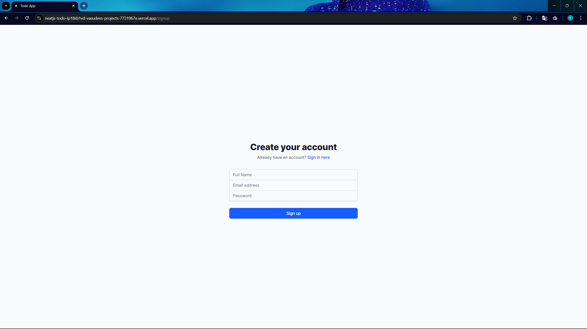
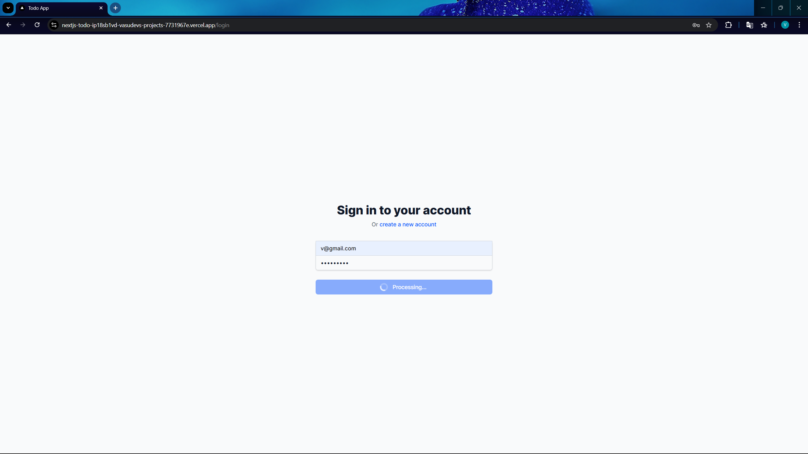
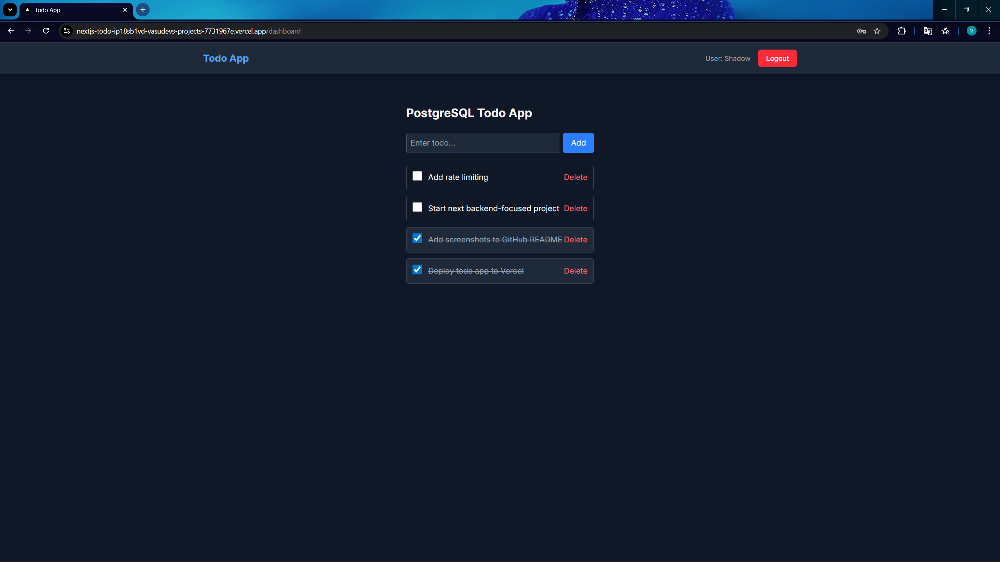
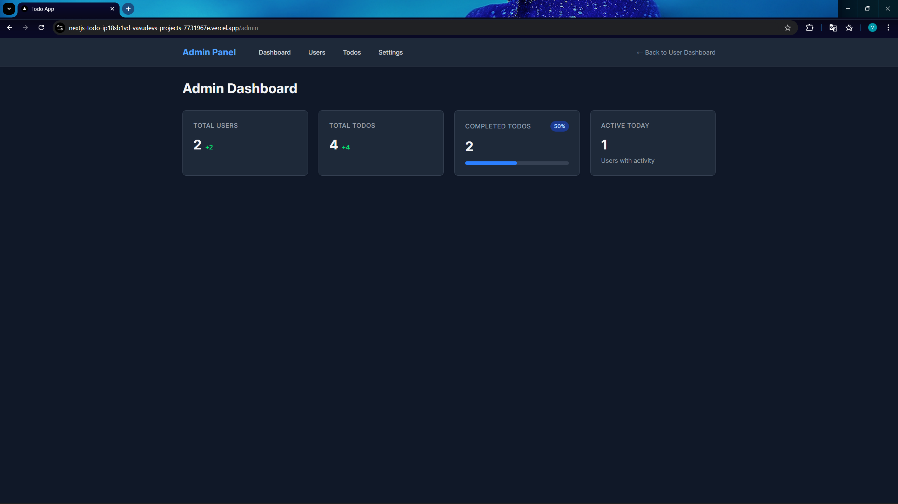

# Auth-Based Todo App

A production-ready **Todo application** built with **Next.js**, **PostgreSQL**, and **session-based authentication**, using **Prisma ORM** for safe and maintainable database access.

This project focuses on **backend correctness, schema discipline, and real-world auth patterns** — not tutorial shortcuts.

---

## 📸 Preview

### Welcome

### SignUp

### Login

### Dashboard

### Admin

---

## 🚀 Features

- User authentication (signup / login / logout)
- **Session-based authentication** (server-side, no JWT)
- Secure cookies (`httpOnly`, `secure`, `sameSite=lax`)
- Role-ready user model (`user`, `admin`)
- Create, complete, and soft-delete todos
- PostgreSQL with **proper constraints & indexes**
- **Atomic DB operations** (transactions & raw SQL where needed)
- Prisma ORM with explicit Postgres adapter (Prisma 7)
- Production-ready setup for **Vercel + Neon**

---

## 🛠 Tech Stack

### Frontend

- Next.js (App Router)
- React
- TypeScript
- Tailwind CSS

### Backend

- Next.js Route Handlers / Server Actions
- **Prisma ORM (v7)**
- PostgreSQL
- `@prisma/adapter-pg` (explicit DB adapter)
- `bcryptjs` (password hashing)
- `zod` (input validation)

### Infrastructure

- Neon (cloud PostgreSQL)
- Vercel (deployment)

---

## 🗄 Database Schema

Managed via **Prisma schema + migrations**, mapped cleanly to PostgreSQL tables.

### user

- `id` (serial, primary key)
- `email` (unique)
- `password_hash`
- `name`
- `role` (`user` | `admin`)
- `created_at`, `updated_at`

### session

- `id` (session token)
- `user_id` (FK → users)
- `expires_at`
- `created_at`

### todo

- `id`
- `title`
- `is_completed`
- `deleted_at` (soft delete)
- `user_id` (FK → users)
- `created_at`

Indexes are added on frequently queried columns (`email`, `user_id`, `deleted_at`, session expiration).

---

## 🔐 Authentication Model

- Passwords are hashed using **bcrypt**
- Login creates a **session record** in PostgreSQL
- Session ID is stored in an **HTTP-only cookie**
- All protected routes validate the session **server-side**
- Logout deletes both the cookie and the DB session

This mirrors **real production auth systems** and avoids common JWT pitfalls.

---

## 🧠 Database Access Strategy

- Prisma is used for **most queries** (type-safe, maintainable)
- **Raw SQL is used selectively** for:

  - atomic updates (e.g. toggling todo state)
  - operations Prisma cannot express safely in one query

- This hybrid approach balances **correctness, performance, and clarity**

---

## 📌 Why This Project

This project was built to:

- Practice **real authentication patterns**
- Learn **Prisma migrations on an existing database**
- Understand PostgreSQL constraints, indexes, and sessions
- Avoid ORM magic and know when to drop to SQL
- Build something that reflects **industry-grade backend fundamentals**

---

## 📄 License

This project is for learning and portfolio purposes.

---

## 👤 Author

Built by **Vasu Singhal**

---

> If you’re reviewing this repo:
> focus on the **auth flow, Prisma schema, migrations, and server-side logic** — that’s where the real work lives.
